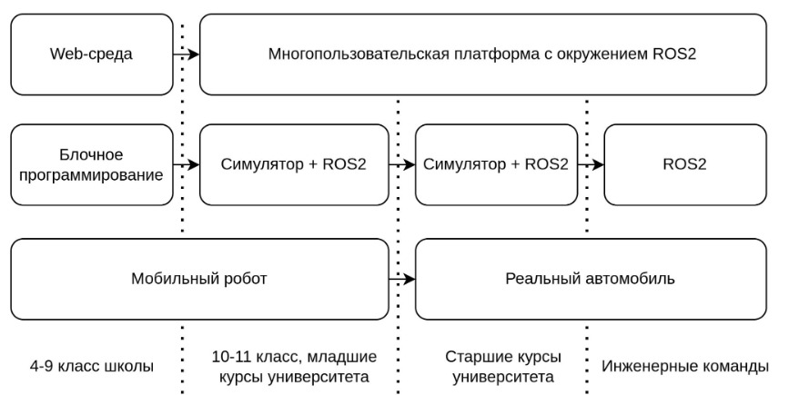
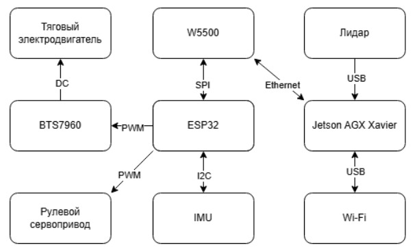
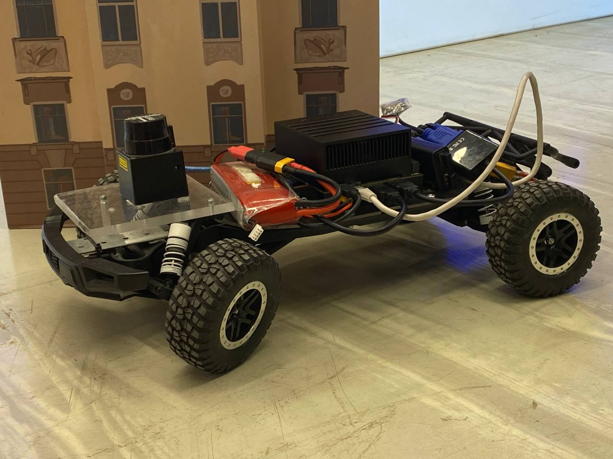
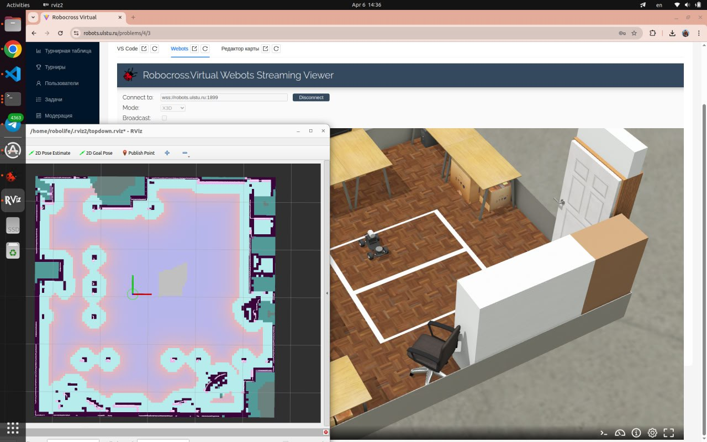
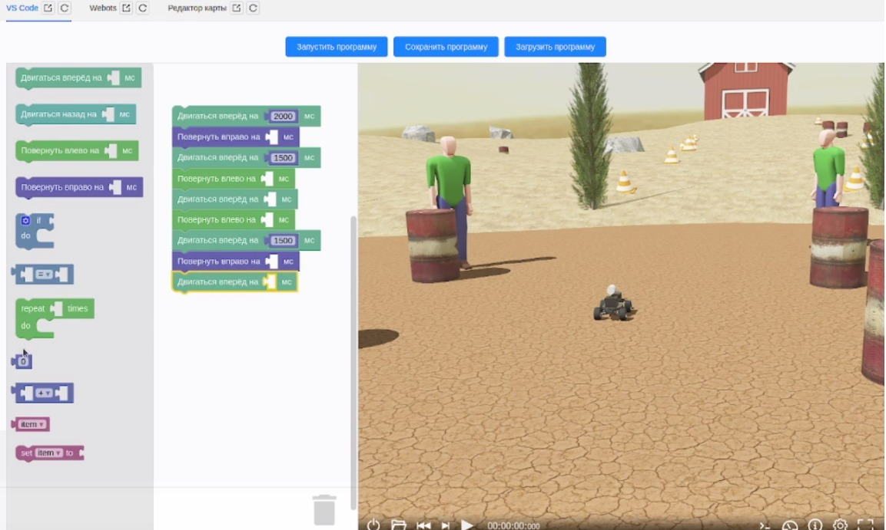

# buggy-learn. Программно-аппаратная платформа прототипирования мобильных роботов

***Назначение***: изучение робототехники с нуля, прототипирование средств решения реальных транспортных задач с использованием мобильных роботов.

***Состав платформы***: 3D модели роботов, узлов и агрегатов, программные библиотеки для построения систем управления, виртуальный полигон, редактор карт, схемотехнические решения, встраиваемое ПО, библиотека транспортных средств для симулятора. На хакатоне разработан робот на базе модели багги-автомобиля

Предлагаемая платформа ориентирована на широкую аудитории: от учеников средней школы до профессиональных инженерных команд, занимающихся разработкой беспилотных транспортных систем.

Ключевое преимущество мобильного робота - использование кинематики Аккермана. Именно она применяется в большинстве реальных транспортных средств. Таким образом обеспечивается простой переход от него к полноразмерному беспилотному автомобилю.
Система управления роботом использует микроконтроллер ESP32 с Ethernet модулем, что позволяет передавать команды управления и данные одометрии надежно и с низкими задержками.
Основной вычислитель робота - микрокомпьютер Nvidia AGX Xavier с развернутым окружением ROS2.

## Мобильный робот

Ключевое преимущество мобильного робота - использование кинематики Аккермана. Именно она применяется в большинстве реальных транспортных средств. Таким образом обеспечивается простой переход от него к полноразмерному беспилотному автомобилю.
Система управления роботом использует микроконтроллер ESP32 с Ethernet модулем, что позволяет передавать команды управления и данные одометрии надежно и с низкими задержками.
Основной вычислитель робота - микрокомпьютер Nvidia AGX Xavier с развернутым окружением ROS2.

В [инструкции](buggy/README.md) описаны схемотехнические и программные решения по сборке и запуску реального багги-автомобиля и решения транспортной задачи

## Инструкция по запуску симулятора и среды программирования в среде ROS2 (старшие классы и студенты)

Виртуальный полигон с полноценным окружением ROS2, что позволяет быстро протестировать написанное решение в виртуальной среде, а затем без изменений перенести его на реального робота. Полигон доступен в Web-среде. Ссылка по запросу.

В [инструкции](ros2/README.md) описано, как в среде docker запустить редактор исходного кода vscode server и симулятор, как настроить отображение в web-среде и оконным приложением

## Инструкция по запуску симулятора и среды программирования в среде blockly (начальная и средняя школа)
Визуальное программирование для школьников в 3D симуляторе:
- Многопользовательский режим
- Множество роботов и сенсоров
- Изучение циклового, адаптивного управления, основы интеллектуального управления

В основе - управление докер контейнерами, специализированные контроллеры Webots

В [инструкции](blockly/README.md) описано, как в среде docker запустить редактор исходного кода blockly и симулятор, как настроить отображение в web-среде и оконным приложением

