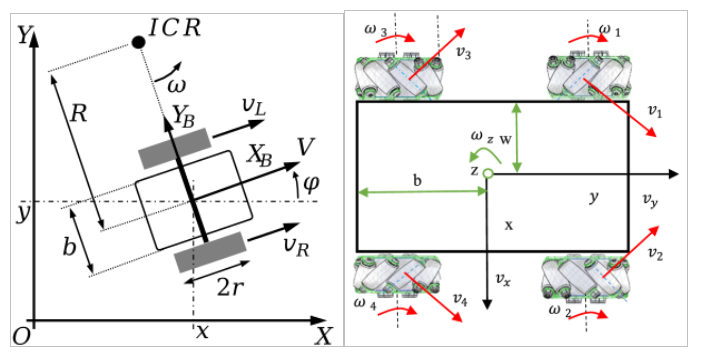
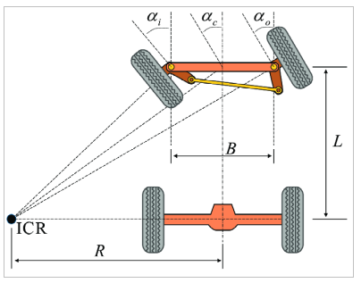
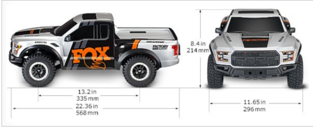
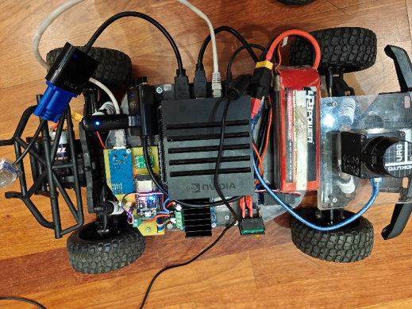
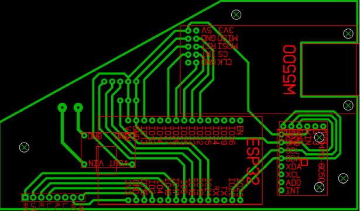
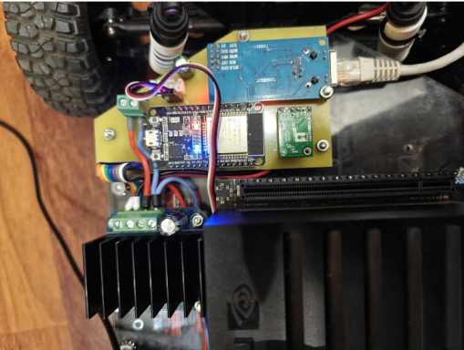

# Модель багги-автомобиля, управляемая ROS 2

## Содержание

- [Модель багги-автомобиля, управляемая ROS 2](#)
  - [Аппаратная часть](#аппаратная-часть)
  - [Программная часть](#программная-часть)
    - [Установка зависимостей. Сборка решения](#установка-зависимостей-сборка-решения)
    - [Запуск и работа с решением](#запуск-и-работа-с-решением)
      1. [Получение данных с лидара и настройка одометрии](#получение-данных-с-лидара-и-настройка-одометрии)
      2. [Построение глобальной карты сцены](#построение-глобальной-карты-сцены)
      3. [Локализация и навигация на построенной карте](#локализация-и-навигация-на-построенной-карте)

## Аппаратная часть

Большинство типовых роботов для обучения, а также программных решений в среде ROS рассчитаны на использование роботов с кинематикой differential wheel или mecanum

 
Реальные транспортные средства как правило используют кинематику Аккермана, накладывающую ограничения на возможную траекторию перемещения робота. 



Это затрудняет применение разработанных решений при автоматизации управления привычными транспортными средствами.

Предлагается использовать в процессе обучения робототехнике разработанную платформу на основе модели автомобиля, имеющего кинематику Аккермана. Данная платформа отличается невысокой стоимостью, высокой проходимостью, большей грузоподъемностью. Но одним из главных преимуществ является возможность использования разработанных в процессе обучения решений при создании беспилотных автомобилей.

Основой робота служит радиоуправляемая модель шорт-корс Traxxas Raptor FORD F-150. Штатная аппаратура дистанционного управления была демонтирована, а на ее место установлен специальный комплект для осуществления управления роботом по сети, а также микрокомпьютер Nvidia Jetson AGX Xavier и сканирующий лазерный дальномер Hokuyo на базе микроконтроллера ESP32.





Полученная платформа с точки зрения принципов управления мало отличается от реального автомобиля с автоматической трансмиссией, что позволяет отлаживать алгоритмы управления в лаборатории, а потом применять их при автоматизации серийно-выпускаемых транспортных средств.

Все оборудование размещается непосредственно на роботе, что позволяет работать полностью автономно.


В качестве управляющего микроконтроллера был выбран ESP32, так как он обладает широкими возможностями при крайне низкой стоимости. В отличие от многих других роботов для обмена данными используется интерфейс Ethernet, реализованный при помощи W5500. Данное решение отличается высокой стабильностью работы, устойчивостью к помехам, отсутствием необходимости задействовать WiFi адаптер микрокомпьютера или иметь внешнюю беспроводную сеть.
Алгоритмы управления роботом запускаются на бортовом компьютере. Был выбран Nvidia AGX Xavier, но могут быть использованы решения других производителей, например, Raspberry PI или наиболее доступный Orange PI.
В примере применен однолучевой лидар Hokuyo модели URG-04LX-UG01, который может быть легко заменен на аналогичные решения китайских производителей. При желании конфигурация может быть дополнена простой или стереокамерой.

В основе низкоуровневой системы управления роботом лежит печатная плата собственной разработки, на которой размещены основные компоненты, включая микроконтроллер семейства ESP32, Ethernet модуль W5500, IMU на основе MEMS от ST microelectronics, преобразователь напряжения 12 – 5 В, а также разъемы для подключения дополнительных компонентов, таких, как плата с транзисторными ключами BTS7960 и сервопривода рулевого управления.

Разводка печатной платы


После монтажа на робота


## Программная часть

Поскольку бортовой компьютер модели *NVIDIA Jetson AGX Xavier* был выпущен в 2018 году, то описываемое ниже программное решение разрабатывалось и запускалось на операционной системе *Linux Ubuntu 20.04* с установленным на ней ROS 2 версии *Foxy*, инструкцию по установке которой вы можете найти [здесь](https://docs.ros.org/en/foxy/Installation/Alternatives/Ubuntu-Development-Setup.html).

Несмотря на это, если вы используете более современное устройство (например, *Raspberry PI* последних годов выпуска) в качестве бортового компьютера для вашего робота, то данная инструкция по-прежнему остаётся актуальной и для более новых версий Ubuntu и ROS 2 (тестировалось на *22.04* и *Humble*), за исключением раздела с портированием пакета для лидарной одометрии *Simple-2D-LiDAR-Odometry* на ROS 2 Foxy, выполнение которого вы можете пропустить если используете ROS 2 версии Humble и выше.

### Установка зависимостей. Сборка решения

1. Устанавливаем [пакет](https://github.com/Hokuyo-aut/urg_node2) с драйвером и все его зависимости для используемой модели лидара *Hokuyo URG-04LX-UG01*, следуя инструкции из раздела под названием «**How to build**». В случае использования лидара другого производителя или модели можно пропустить данный шаг, однако вам самостоятельно придётся заставить ваше устройство отправлять свои данные в формате *LaserScan* в ROS-топик */scan* (см. Рис. 1) для правильной работы дальнейшей логики всего решения:


<div align="center">Рисунок 1 – Данные с лидара в формате LaserScan (белые линии)</div>
<br>

2. Следующими консольными командами устанавливаем пакет *joint_state_publisher_gui* для корректного отображения колёс нашего робота в утилите для визуализации *RViz* и возможности управления ими:

```bash
sudo apt update
sudo apt install ros-$ROS_DISTRO-joint-state-publisher-gui
```

3. Следующей командой устанавливаем библиотеку *slam_toolbox* для построения глобальной карты сцены, окружающей модель багги-автомобиля, и последующей локализации на ней:

```bash
sudo apt install ros-$ROS_DISTRO-slam-toolbox
```

4. Аналогично устанавливаем фреймворк *Nav2* для динамического планирования и построения маршрута движения по глобальной карте с объездом препятствий:

```bash
sudo apt install ros-$ROS_DISTRO-navigation2 ros-$ROS_DISTRO-nav2-bringup
```

5. Устанавливаем пакет *robot_localization* для повышения точности локализации мобильного робота на карте сцены за счёт совмещения лидарной одометрии и данных с IMU:

```bash
sudo apt install ros-$ROS_DISTRO-robot-localization
```

6. В заключение, устанавливаем необходимые для [пакета](https://github.com/dawan0111/Simple-2D-LiDAR-Odometry) с лидарной одометрией зависимости:

```bash
sudo apt-get install libeigen3-dev libpcl-dev
```

7. Если вы используете ROS 2 версии Humble и выше, то можете пропустить этот шаг с портированием данного пакета на Foxy, которое производится следующим образом:

```bash
cd ~/opt/ros/$ROS_DISTRO/include/tf2/tf2
ls | grep .h
sudo nano <ИМЯ ФАЙЛА>.h
```

Далее [здесь](https://docs.ros.org/en/ros2_packages/humble/api/tf2/generated/), в разделе «**Files**», для каждого .h-файла находим *File <ИМЯ ФАЙЛА>.hpp* → *Program Listing for File <ИМЯ ФАЙЛА>.hpp* (раздел «**Definition**»), копируем и заменяем содержимое исходного файла с расширением .h на .hpp. Проделываем так с каждым файлом из вывода команды *ls | grep .h*;

8. Практически всё готово к сборке и развёртыванию оригинального ROS-решения из данного репозитория. Склонируем его:

```bash
cd
mkdir ros2_ws
cd ros2_ws
git clone https://github.com/ulstu/buggy-learn.git
mkdir src
mv buggy-learn/buggy/urg_node2 src

### Для ROS 2 версии Humble и выше
sudo nano src/urg_node2/src/lidar_odometry.cpp
```

9. Для Humble и выше заменяем *boost::make_shared<…>* в строках №5, 56 и 57 на *std::make_shared<…>*. Для Foxy оставляем всё как есть с *boost* вместо *std*;
10. Сохраняем все изменения и собираем решение следующими консольными командами:

```bash
colcon build
source install/setup.bash
```

### Запуск и работа с решением

Теперь наш стек наконец-то готов к запуску, однако перед тем как переходить к построению глобальной карты сцены, локализации и навигации на ней, нужно удостовериться, что алгоритмы будут получать все необходимые для своей корректной работы данные, и что они имеют правильный формат.

#### Получение данных с лидара и настройка одометрии

Предполагается, что вы уже получаете данные с лидара и публикуете их в топик /scan в формате LaserScan (см. Рис. 1). Для лидара модели Hokuyo URG-04LX-UG01 его настройки (файл *params_ether.yaml*) выглядят следующим образом:

```yaml
urg_node2:
  ros__parameters:
    ip_address: '' # Пустая строка при подлючении через последовательный порт, иначе – IP-адрес
    ip_port: 10940
    frame_id : 'laser' # Измените название фрейма-привязки для данных в соответствии с URDF-описанием вашего робота
    calibrate_time : false
    synchronize_time : false
    publish_intensity : false
    publish_multiecho : false
    error_limit : 4
    error_reset_period : 5.0
    diagnostics_tolerance : 0.05
    diagnostics_window_time : 5.0
    time_offset : 0.0
    angle_min : -3.14
    angle_max : 3.14
    skip : 0
    cluster : 1
```

В файле *lidar_odometry_node.cpp* в функциях под названием «*parameter_initialization*» и «*publish_odometry*» замените названия топиков скана с одометрией, а также фреймов в соответствии со своими при необходимости:

```cpp
void parameter_initilization() {
    this->declare_parameter<double>("max_correspondence_distance", 0.25);
    this->declare_parameter<double>("transformation_epsilon", 0.005);
    this->declare_parameter<double>("maximum_iterations", 30);
    this->declare_parameter<std::string>("scan_topic_name", "scan"); // Замените названия топиков на свои
    this->declare_parameter<std::string>("odom_topic_name", "odom"); // при необходимости
}
```

```cpp
void publish_odometry() {
    auto state = lidar_odometry_ptr->get_state();

    tf.header.stamp = this->get_clock()->now();
    tf.header.frame_id = "odom";     // Замените названия фреймов на свои
    tf.child_frame_id = "base_link"; // при необходимости

    tf.transform.translation.x = state->pose.translation().x();
    tf.transform.translation.y = state->pose.translation().y();
    tf.transform.translation.z = 0.0; // state->pose.translation().z();

    odom.header.stamp = this->get_clock()->now();
    odom.header.frame_id = "odom";     // Замените названия фреймов на свои
    odom.child_frame_id = "base_link"; // при необходимости

    odom.pose.pose = Eigen::toMsg(state->pose);
    odom.pose.pose.position.z = 0.0;

    tf.transform.rotation = odom.pose.pose.orientation;
    odom.twist.twist = Eigen::toMsg(state->velocity);

    tf_broadcaster->sendTransform(tf);
    odom_publisher->publish(odom);
}
```

При желании, значения таких параметров как: *max_correspondence_distance* (максимальное расстояние в метрах до которого точки из LaserScan будут сопоставляться), *transformation_epsilon* (требуемая точность сопоставления) и *maximum_iterations* (максимальное количество итераций сопоставления до достижения требуемоей точности) также могут быть изменены для достижения более высокого качества лидарной одометрии или для снижения вычислительных затрат алгоритмов из библиотек *Eigen* и *PCL*.

Помимо этого, предполагается, что вы также уже отправляете в требуемом формате данные IMU с нижнего уровня на верхний любым удобным для вас способом. В файле *robot_controller_node.py* логика получения этих данных и их публикация в топик */imu* для пакета robot_localization представлена следующим образом:

```python
def __udp_data_receiver(self):
        sock = socket.socket(socket.AF_INET, socket.SOCK_DGRAM)
        sock.bind(('0.0.0.0', UDP_SERVER_PORT))

        while True:
            current_step_time = time.time()

            if self.__last_cmd_vel_callback_time is not None and current_step_time - self.__last_cmd_vel_callback_time > 3:
                self.__stop()

            data = sock.recv(RECV_BUFFER_SIZE)

            if data:
                data_dict = json.loads(data)

                self.__imu_message.header.stamp.sec = data_dict['params'][0]['header']['stamp']['secs']
                self.__imu_message.header.stamp.nanosec = data_dict['params'][0]['header']['stamp']['nsecs']

                self.__imu_message.linear_acceleration.x = data_dict['params'][0]['linear_acceleration']['x']
                self.__imu_message.linear_acceleration.y = data_dict['params'][0]['linear_acceleration']['y']
                self.__imu_message.linear_acceleration.z = data_dict['params'][0]['linear_acceleration']['z']
                # self.__imu_message.linear_acceleration_covariance = data_dict['params'][0]['linear_acceleration_covariance']

                self.__imu_message.angular_velocity.x = data_dict['params'][0]['angular_velocity']['x']
                self.__imu_message.angular_velocity.y = data_dict['params'][0]['angular_velocity']['y']
                self.__imu_message.angular_velocity.z = data_dict['params'][0]['angular_velocity']['z']
                # self.__imu_message.angular_velocity_covariance = data_dict['params'][0]['angular_velocity_covariance']

                self.__imu_message.orientation.x = data_dict['params'][0]['orientation']['x']
                self.__imu_message.orientation.y = data_dict['params'][0]['orientation']['y']
                self.__imu_message.orientation.z = data_dict['params'][0]['orientation']['z']
                self.__imu_message.orientation.w = data_dict['params'][0]['orientation']['w']
                # self.__imu_message.orientation_covariance = data_dict['params'][0]['orientation_covariance']

                self.__imu_publisher.publish(self.__imu_message)
```

Параметры же самого пакета для повышения точности локализации мобильного робота на карте сцены за счёт совмещения лидарной одометрии и данных с IMU находятся в файле под названием «*robot_localization.yaml*».

В случае, если вы планируете использовать robot_localization, замените названия следующих фреймов и топиков на свои при необходимости:

```yaml
…

map_frame: map
odom_frame: odom
base_link_frame: base_link
world_frame: odom

odom0: /odom

…

imu0: /imu

…
```

В случае, если вы не планируете использовать robot_localization с его *ekf_filter_node*, в основном файле запуска *urg_node2.launch.py* сформируйте *LaunchDescription* следующим образом:

```python
return LaunchDescription([
    DeclareLaunchArgument('auto_start', default_value='true'), 
    DeclareLaunchArgument('node_name', default_value='urg_node2'), 
    DeclareLaunchArgument('scan_topic_name', default_value='scan'), 
    lifecycle_node, 
    lidar_odometry_node, 
    robot_state_publisher, 
    robot_controller_node, 
    # robot_localization_node, ← раскомментировать при использовании ekf_filter_node
    async_slam_toolbox_node, 
    # localization_slam_toolbox_node, 
    rviz, 
    joint_state_publisher_gui, 
    urg_node2_node_configure_event_handler, 
    urg_node2_node_activate_event_handler, 
] + static_transform_nodes)
```

#### Построение глобальной карты сцены

На всё том же Рисунке 1, множество красных стрелок – это одометрия нашего робота. Она должна примерно совпадать с фактическим перемещением вашего робота в физическом мире. Если это так, то можно приступать к построению карты с использованием библиотеки slam_toolbox в режиме картирования:

```yaml
### Файл mapper_params_online_async.yaml

…

# ROS parameters
odom_frame: odom           # Замените названия фреймов и топиков на свои при необходимости
map_frame: map             #
base_frame: base_footprint #
scan_topic: /scan          #
use_map_saver: true        #
mode: mapping              # Выбираем режим картирования (построения карты)

…
```

Запускаем решение следующей командой, которая автоматически откроет утилиту для визуализации RViz, в которой можно будет контролировать весь процесс, как это показано на Рисунке 2:

```bash
cd ~/ros2_ws
colcon build
source install/setup.bash
ros2 launch urg_node2 urg_node2.launch.py
```


<div align="center">Рисунок 2 – Визуализация процесса картирования в утилите RViz</div>
<br>

Для ручного WASD-управления машинкой был написан специальный узел под названием «*ackermann_keyboard_teleop_node*», который запускается отдельно следующей командой:

```bash
ros2 run urg_node2 ackermann_keyboard_teleop_node.py
```

Если ваш робот не обладает *кинематикой Акерманна*, то вы можете установить и использовать исходный пакет *teleop_twist_keyboard* для похожего управления с клавиатуры или *teleop_twist_joy* для управления с джойстика:

```bash
sudo apt update
sudo apt install ros-$ROS_DISTRO-teleop-twist-keyboard ros-$ROS_DISTRO-teleop-twist-joy
```

Убедитесь, что управляющие команды поступают в нужные топики и корректно перенаправляются на нижний уровень, где безопасно обрабатываются контроллерами.

После того как вы закончили строить глобальную карту сцены, её необходимо сохранить. В RViz это делается следующим образом:


<div align="center">Рисунок 3 – В верхнем меню Panels → Add New Panel</div>
<br>


<div align="center">Рисунок 4 – Вводим первое название файла карты → Save Map</div>
<br>


<div align="center">Рисунок 5 – Вводим второе название файла карты → Serialize Map</div>
<br>

По умолчанию все файлы (*.data*, *.pgm*, *.posegraph* и *.yaml*) сохраняются в ту директорию, в которой была запущена утилита. Переместите их в предлагаемую нашим решением директорию по умолчанию – **~/ros2_ws/src/urg_node2/config/slam_toolbox/map**.

#### Локализация и навигация на построенной карте

Локализация на построенной карте может осуществляться как средствами того же SLAM Toolbox только теперь уже в соответствующем режиме:

```yaml
### Файл mapper_params_online_async.yaml

…

mode: localization # Выбираем режим локализации (определения положения робота на построенной карте)

# Указываем полный путь до сохранённых ранее файлов карты
map_file_name: '~/ros2_ws/src/urg_node2/config/slam_toolbox/map/real_map'
map_start_pose: [0.0, 0.0, 0.0]
map_start_at_dock: true
```

Либо же с использованием *AMCL* из фреймворка Nav2:

```yaml
### Файл nav2_params.yaml

# Adaptive Monte Carlo Localization для определения позиции и ориентации робота на карте
amcl:
  ros__parameters:
    alpha1: 0.15
    alpha2: 0.15
    alpha3: 0.15
    alpha4: 0.15
    alpha5: 0.15
    base_frame_id: base_footprint # Замените на свой при необходимости
    beam_skip_distance: 0.7
    beam_skip_error_threshold: 0.99
    beam_skip_threshold: 0.5
    do_beamskip: true
    global_frame_id: map # Замените на свой при необходимости
    lambda_short: 0.1
    laser_likelihood_max_dist: 1.5
    laser_max_range: 5.6
    laser_min_range: 0.0
    set_initial_pose: true
    # Выставите начальную позицию робота (Initial Pose) в соответствии с вашей картой и того её места, откуда вы начинали её строить
    initial_pose: {
      x: 0.240,
      y: 0.007,
      z: 0.000,
      yaw: 0.0,
    }
    laser_model_type: "beam"
    max_beams: 30
    max_particles: 500
    min_particles: 100
    odom_frame_id: odom # Замените на свой при необходимости
    pf_err: 0.1
    pf_z: 0.95
    recovery_alpha_fast: 0.0
    recovery_alpha_slow: 0.0
    resample_interval: 3
    robot_model_type: "differential"
    save_pose_rate: 0.5
    sigma_hit: 0.2
    tf_broadcast: true
    transform_tolerance: 0.1
    service_introspection_mode: "disabled"
    update_min_a: 0.1
    update_min_d: 0.1
    z_hit: 0.5
    z_max: 0.05
    z_rand: 0.5
    z_short: 0.05
    always_reset_initial_pose: true
    scan_topic: scan # Замените на свой при необходимости

    …
```

Независимо от используемого инструмента, для корректного осуществления навигации на построенной карте с помощью Nav2, в файле с его параметрами *nav2_params.yaml* полный путь до сохранённого ранее .yaml-файла карты должен быть указан следующим образом:

```yaml
# Загрузка статической глобальной карты, построенной с использованием SLAM Toolbox
map_server:
ros__parameters:
yaml_filename: '~/ros2_ws/src/urg_node2/config/slam_toolbox/map/real_map.yaml'
map_subscribe_transient_local: true
```

Также не забудьте изменить пути *default_bt_xml_filename*, *default_nav_to_pose_bt_xml* и *default_nav_through_poses_bt_xml* в параметрах *bt_navigator*, если вы используете ROS 2 версии Foxy. При использовании более новых версий и, при условии, что вы не знаете или не хотите настраивать bt_navigator, все связанные с ним параметры, а также одноимённая папка в директории **~/ros2_ws/src/urg_node2/config/nav2** могут быть удалены.

Перед очередным запуском решения, убедитесь, что в файле urg_node2.launch.py правильно составлен LaunchDescription:

```python
return LaunchDescription([
    DeclareLaunchArgument('auto_start', default_value='true'), 
    DeclareLaunchArgument('node_name', default_value='urg_node2'), 
    DeclareLaunchArgument('scan_topic_name', default_value='scan'), 
    lifecycle_node, 
    lidar_odometry_node, 
    robot_state_publisher, 
    robot_controller_node, 
    # robot_localization_node, ← раскомментировать при использовании ekf_filter_node
    # async_slam_toolbox_node, 
    # localization_slam_toolbox_node, ← раскомментировать при использовании локализации от SLAM Toolbox
    rviz, 
    joint_state_publisher_gui, 
    urg_node2_node_configure_event_handler, 
    urg_node2_node_activate_event_handler, 
])  # + static_transform_nodes
```

Запускаем решение:

```bash
cd ~/ros2_ws
colcon build
source install/setup.bash
ros2 launch urg_node2 urg_node2.launch.py
```

В отдельной консоли запускаем Nav2:

```bash
ros2 launch nav2_bringup navigation_launch.py params_file:=nav2_params.yaml map_subscribe_transient_local:=true use_sim_time:=false
```

При использовании локализации от этого же фреймворка, перед его запуском в отдельной консоли запускаем AMCL:

```bash
ros2 launch nav2_bringup localization_launch.py params_file:=nav2_params.yaml map:=../slam_toolbox/map/real_map.yaml use_sim_time:=false
```


<div align="center">Рисунок 6 – Визуализация процесса локализации и навигации в утилите RViz</div>
<br>


<div align="center">Конечный результат</div>
